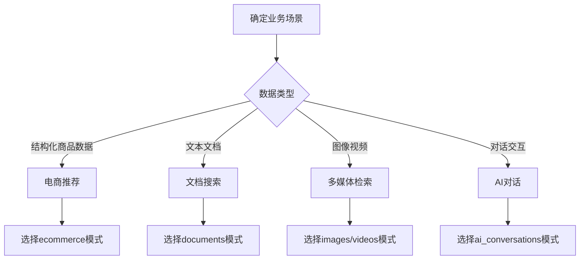

# 实际应用场景示例

这里提供了各种业务场景下使用 milvus-fake-data 的具体示例，帮助你快速应用到实际项目中。

## 📋 场景分类

### 🛒 电商推荐系统
- [商品相似度搜索](ecommerce-similarity.md) - 基于商品特征的相似商品推荐
- [用户行为分析](user-behavior.md) - 用户购买偏好向量化分析
- [个性化推荐](personalized-recommendations.md) - 用户画像与商品匹配

### 📚 知识管理系统  
- [文档语义搜索](document-search.md) - 企业知识库智能检索
- [FAQ 智能问答](faq-chatbot.md) - 客服机器人知识库
- [代码搜索引擎](code-search.md) - 代码片段语义检索

### 🎵 多媒体应用
- [图像相似性搜索](image-similarity.md) - 以图搜图功能实现
- [音频指纹识别](audio-fingerprint.md) - 音乐识别和版权检测
- [视频内容分析](video-analysis.md) - 视频场景和内容理解

### 🤖 AI 应用场景
- [对话系统](conversation-ai.md) - 聊天机器人对话历史分析
- [情感分析](sentiment-analysis.md) - 用户评论情感向量化
- [内容审核](content-moderation.md) - 违规内容自动识别

### 🔐 安全与监控
- [异常检测](anomaly-detection.md) - 系统行为异常识别
- [欺诈检测](fraud-detection.md) - 金融交易风险识别
- [网络安全](cybersecurity.md) - 网络流量异常监控

## 🚀 快速开始

### 选择适合的场景

根据你的业务需求选择最相近的场景：

```bash
# 电商推荐系统
milvus-fake-data generate --builtin ecommerce --rows 100000 --out ./ecommerce_demo

# 文档搜索系统
milvus-fake-data generate --builtin documents --rows 50000 --out ./docs_demo

# 多媒体应用
milvus-fake-data generate --builtin images --rows 30000 --out ./media_demo

# AI 对话系统
milvus-fake-data generate --builtin ai_conversations --rows 20000 --out ./ai_demo
```

### 查看具体示例

每个场景都包含：

- **业务背景** - 实际应用场景描述
- **数据模式** - 针对场景优化的数据结构  
- **生成命令** - 具体的数据生成步骤
- **导入配置** - Milvus 集合配置
- **查询示例** - 典型的搜索和分析查询
- **性能调优** - 针对场景的优化建议
- **扩展方案** - 实际应用中的扩展思路

## 🎯 按数据规模选择

### 原型验证 (1K-10K 行)
快速验证概念和算法：

```bash
# 快速原型
milvus-fake-data generate --builtin simple --rows 1000 --preview
milvus-fake-data generate --builtin ecommerce --rows 5000 --out ./prototype
```

**适用场景:**
- 概念验证（POC）
- 算法调试
- 界面原型展示
- 功能测试

### 开发测试 (10K-100K 行)
开发阶段的功能测试：

```bash
# 开发测试
milvus-fake-data generate --builtin documents --rows 50000 --out ./dev_test
milvus-fake-data generate --builtin users --rows 20000 --out ./user_test
```

**适用场景:**
- 功能开发
- 集成测试  
- 性能初步评估
- 用户体验测试

### 压力测试 (100K-1M 行)
模拟真实负载的压力测试：

```bash
# 压力测试
milvus-fake-data generate --builtin ecommerce --rows 500000 --batch-size 50000 --out ./stress_test
milvus-fake-data generate --builtin images --rows 200000 --out ./load_test
```

**适用场景:**
- 性能压力测试
- 容量规划
- 系统调优
- 预发布验证

### 生产模拟 (1M+ 行)
接近生产环境的大规模测试：

```bash
# 生产规模
milvus-fake-data generate --builtin documents --rows 5000000 \
  --batch-size 100000 --max-file-size 512 --out ./production_scale
```

**适用场景:**
- 生产环境压测
- 容量验证
- 灾难恢复测试
- 系统极限测试

## 📊 按向量维度选择

### 低维向量 (64-128 维)
适合简单特征和快速检索：

```bash
# 低维度应用
milvus-fake-data generate --builtin simple --rows 100000  # 128维
milvus-fake-data generate --builtin face_recognition --rows 50000  # 512维人脸特征
```

**特点:**
- 检索速度快
- 内存占用小
- 适合实时应用
- 特征表达相对简单

### 中维向量 (256-512 维)
平衡表达能力和性能：

```bash
# 中等维度应用  
milvus-fake-data generate --builtin ecommerce --rows 100000  # 多个256-512维向量
milvus-fake-data generate --builtin images --rows 50000     # 512维图像特征
```

**特点:**
- 表达能力较强
- 性能适中
- 适合大多数业务场景
- 平衡精度和效率

### 高维向量 (768+ 维)
丰富语义表达的大模型向量：

```bash
# 高维度应用
milvus-fake-data generate --builtin documents --rows 100000  # 768维BERT嵌入
milvus-fake-data generate --builtin ai_conversations --rows 50000  # 1536维GPT嵌入
```

**特点:**
- 语义表达丰富
- 检索精度高
- 资源消耗大
- 适合知识检索

## 🏗️ 按架构模式选择

### 单集合架构
适合简单场景和小规模应用：

```bash
# 单集合设计
milvus-fake-data generate --builtin simple --rows 100000 --out ./single_collection
milvus-fake-data to-milvus insert ./single_collection
```

**特点:**
- 架构简单
- 管理方便
- 适合单一业务场景
- 扩展性有限

### 多集合架构
不同数据类型分别存储：

```bash
# 多集合设计
milvus-fake-data generate --builtin users --rows 50000 --out ./users_collection
milvus-fake-data generate --builtin ecommerce --rows 100000 --out ./products_collection
milvus-fake-data generate --builtin documents --rows 30000 --out ./docs_collection

# 分别导入
milvus-fake-data to-milvus insert ./users_collection --collection-name users
milvus-fake-data to-milvus insert ./products_collection --collection-name products  
milvus-fake-data to-milvus insert ./docs_collection --collection-name documents
```

**特点:**
- 数据隔离清晰
- 可独立优化
- 扩展性好
- 管理复杂度中等

### 分区架构
单集合内按业务逻辑分区：

```bash
# 分区集合设计
milvus-fake-data generate --builtin ecommerce_partitioned --rows 500000 --out ./partitioned_data
milvus-fake-data to-milvus insert ./partitioned_data
```

**特点:**
- 查询效率高
- 便于数据生命周期管理
- 支持分区级操作
- 设计复杂度较高

## 💡 最佳实践建议

### 1. 场景选择策略



### 2. 规模规划原则

- **从小开始**: 先用小规模数据验证概念
- **逐步扩大**: 确认可行后再增加数据规模  
- **性能监控**: 每个阶段都要测试性能指标
- **容量预留**: 生产环境预留30-50%容量余量

### 3. 性能优化要点

```bash
# 针对不同场景的优化建议

# 高QPS场景 - 使用较小向量维度
milvus-fake-data generate --builtin simple --rows 1000000  # 128维

# 高精度场景 - 使用大模型向量
milvus-fake-data generate --builtin documents --rows 100000  # 768维

# 大数据量场景 - 优化批处理
milvus-fake-data generate --builtin ecommerce --rows 5000000 \
  --batch-size 100000 --max-file-size 512
```

### 4. 监控和运维

每个场景都应该包含：

- **健康检查**: 定期验证数据完整性
- **性能监控**: QPS、延迟、资源使用
- **容量管理**: 数据增长趋势预测
- **备份恢复**: 定期备份重要数据

## 🔗 快速导航

根据你的具体需求，选择最相关的示例开始：

| 如果你想构建... | 推荐查看 | 数据模式 |
|----------------|----------|----------|
| 商品推荐系统 | [电商相似度搜索](ecommerce-similarity.md) | `ecommerce` |
| 企业知识库 | [文档语义搜索](document-search.md) | `documents` |
| 智能客服 | [FAQ 智能问答](faq-chatbot.md) | `ai_conversations` |
| 以图搜图 | [图像相似性搜索](image-similarity.md) | `images` |
| 用户推荐 | [个性化推荐](personalized-recommendations.md) | `users` |
| 内容审核 | [内容审核](content-moderation.md) | `news` |

---

**💡 提示**: 如果没有找到完全匹配的场景，可以选择最相近的示例，然后根据[自定义模式教程](../tutorials/custom-schemas.md)进行调整。