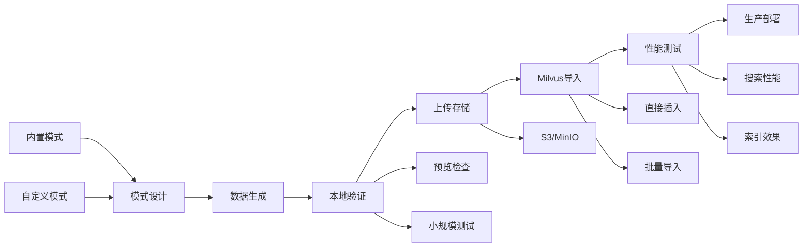

# 完整工作流教程

从数据生成到 Milvus 生产部署的端到端完整流程，涵盖开发、测试、预发布、生产环境的最佳实践。

## 🎯 工作流概览



## 🏗️ 阶段一：环境准备

### 1.1 开发环境搭建

```bash
# 项目克隆和初始化
git clone https://github.com/zilliz/milvus-fake-data.git
cd milvus-fake-data
pdm install

# 启动本地测试环境
cd deploy/
docker-compose up -d

# 验证服务状态
curl http://localhost:19530/healthz  # Milvus
curl http://localhost:9000/minio/health/live  # MinIO

# 设置环境变量
export MILVUS_URI=http://127.0.0.1:19530
export MINIO_HOST=127.0.0.1
export MINIO_ACCESS_KEY=minioadmin
export MINIO_SECRET_KEY=minioadmin
export MINIO_BUCKET=milvus-data
```

### 1.2 项目结构规划

```bash
mkdir -p {schemas,data,scripts,configs}

# 创建工作目录结构
project/
├── schemas/          # 自定义模式文件
├── data/            # 生成的数据集
├── scripts/         # 自动化脚本
├── configs/         # 环境配置
└── docs/           # 项目文档
```

## 📋 阶段二：模式设计与验证

### 2.1 需求分析

假设我们要构建一个**智能客服知识库**系统：

**业务需求:**
- 存储FAQ文档和答案
- 支持语义搜索
- 包含分类和标签
- 支持多语言
- 需要用户反馈评分

### 2.2 模式设计

```bash
# 创建知识库模式
cat > schemas/knowledge_base.json << 'EOF'
{
  "collection_name": "knowledge_base",
  "description": "智能客服知识库向量搜索集合",
  "fields": [
    {
      "name": "doc_id",
      "type": "Int64",
      "is_primary": true,
      "auto_id": true,
      "description": "文档唯一标识"
    },
    {
      "name": "question",
      "type": "VarChar",
      "max_length": 500,
      "description": "用户问题"
    },
    {
      "name": "answer",
      "type": "VarChar", 
      "max_length": 2000,
      "description": "标准答案"
    },
    {
      "name": "category",
      "type": "VarChar",
      "max_length": 100,
      "description": "问题分类"
    },
    {
      "name": "tags",
      "type": "Array",
      "element_type": "VarChar",
      "max_capacity": 10,
      "max_length": 50,
      "description": "问题标签"
    },
    {
      "name": "language",
      "type": "VarChar",
      "max_length": 10,
      "description": "语言代码"
    },
    {
      "name": "confidence_score",
      "type": "Float",
      "min": 0.0,
      "max": 1.0,
      "description": "答案置信度"
    },
    {
      "name": "last_updated",
      "type": "VarChar",
      "max_length": 20,
      "description": "最后更新时间"
    },
    {
      "name": "is_active",
      "type": "Bool",
      "description": "是否激活"
    },
    {
      "name": "question_embedding",
      "type": "FloatVector",
      "dim": 768,
      "description": "问题语义向量"
    },
    {
      "name": "answer_embedding", 
      "type": "FloatVector",
      "dim": 768,
      "description": "答案语义向量"
    },
    {
      "name": "metadata",
      "type": "JSON",
      "nullable": true,
      "description": "扩展元数据"
    }
  ]
}
EOF
```

### 2.3 模式验证

```bash
# 验证模式格式
milvus-fake-data generate --schema schemas/knowledge_base.json --validate-only

# 预览数据结构
milvus-fake-data generate --schema schemas/knowledge_base.json --rows 10 --preview

# 查看详细字段信息
milvus-fake-data schema help --field-type Array
milvus-fake-data schema help --field-type JSON
```

### 2.4 注册模式

```bash
# 将模式添加到管理库
milvus-fake-data schema add knowledge_base schemas/knowledge_base.json \
  --description "智能客服知识库模式" \
  --tags "客服,FAQ,语义搜索,多语言"

# 验证注册成功
milvus-fake-data schema show knowledge_base
```

## 🔬 阶段三：数据生成与验证

### 3.1 小规模验证测试

```bash
# 生成小样本数据进行验证
milvus-fake-data generate \
  --builtin knowledge_base \
  --rows 1000 \
  --out data/kb_sample \
  --seed 42

# 检查生成结果
ls -la data/kb_sample/
head -n 5 data/kb_sample/meta.json
```

### 3.2 数据质量检查脚本

```bash
# 创建数据质量检查脚本
cat > scripts/validate_data.py << 'EOF'
#!/usr/bin/env python3
"""数据质量验证脚本"""

import pandas as pd
import json
from pathlib import Path
import sys

def validate_knowledge_base_data(data_dir):
    """验证知识库数据质量"""
    data_path = Path(data_dir)
    
    # 读取数据
    parquet_file = data_path / "data.parquet"
    meta_file = data_path / "meta.json"
    
    if not parquet_file.exists():
        print("❌ 数据文件不存在")
        return False
        
    df = pd.read_parquet(parquet_file)
    
    with open(meta_file) as f:
        meta = json.load(f)
    
    print(f"📊 数据集统计:")
    print(f"  - 总行数: {len(df):,}")
    print(f"  - 字段数: {len(df.columns)}")
    print(f"  - 文件大小: {parquet_file.stat().st_size / 1024 / 1024:.1f} MB")
    
    # 基础验证
    issues = []
    
    # 检查主键唯一性
    if df['doc_id'].duplicated().any():
        issues.append("❌ 主键存在重复")
    else:
        print("✅ 主键唯一性检查通过")
    
    # 检查必填字段
    required_fields = ['question', 'answer', 'category']
    for field in required_fields:
        if df[field].isnull().any():
            issues.append(f"❌ 字段 {field} 存在空值")
        else:
            print(f"✅ 字段 {field} 完整性检查通过")
    
    # 检查向量维度
    vector_fields = ['question_embedding', 'answer_embedding']
    for field in vector_fields:
        sample_vector = df[field].iloc[0]
        if len(sample_vector) != 768:
            issues.append(f"❌ 向量字段 {field} 维度错误: {len(sample_vector)}")
        else:
            print(f"✅ 向量字段 {field} 维度正确: 768")
    
    # 检查分类分布
    category_dist = df['category'].value_counts()
    print(f"\n📈 分类分布:")
    for category, count in category_dist.head(10).items():
        print(f"  - {category}: {count} ({count/len(df)*100:.1f}%)")
    
    # 检查语言分布
    lang_dist = df['language'].value_counts()
    print(f"\n🌍 语言分布:")
    for lang, count in lang_dist.items():
        print(f"  - {lang}: {count} ({count/len(df)*100:.1f}%)")
    
    if issues:
        print(f"\n⚠️  发现 {len(issues)} 个问题:")
        for issue in issues:
            print(f"  {issue}")
        return False
    else:
        print(f"\n✅ 数据质量验证通过!")
        return True

if __name__ == "__main__":
    if len(sys.argv) != 2:
        print("用法: python validate_data.py <data_directory>")
        sys.exit(1)
    
    success = validate_knowledge_base_data(sys.argv[1])
    sys.exit(0 if success else 1)
EOF

chmod +x scripts/validate_data.py
```

```bash
# 运行数据质量检查
python scripts/validate_data.py data/kb_sample
```

### 3.3 中等规模测试

```bash
# 生成中等规模数据进行性能测试
milvus-fake-data generate \
  --builtin knowledge_base \
  --rows 50000 \
  --batch-size 10000 \
  --out data/kb_medium \
  --seed 42

# 验证数据质量
python scripts/validate_data.py data/kb_medium
```

## 📤 阶段四：存储上传

### 4.1 配置存储环境

```bash
# 创建环境配置文件
cat > configs/storage.env << 'EOF'
# MinIO/S3 配置
MINIO_ENDPOINT=http://localhost:9000
MINIO_ACCESS_KEY=minioadmin
MINIO_SECRET_KEY=minioadmin
MINIO_BUCKET=knowledge-base-data

# 生产环境配置 (注释掉，生产时启用)
# MINIO_ENDPOINT=https://s3.company.com
# MINIO_ACCESS_KEY=prod_access_key
# MINIO_SECRET_KEY=prod_secret_key
# MINIO_BUCKET=prod-milvus-data
EOF

# 加载配置
source configs/storage.env
```

### 4.2 上传数据

```bash
# 上传测试数据
milvus-fake-data upload data/kb_sample \
  s3://$MINIO_BUCKET/knowledge-base/v1.0/sample/ \
  --endpoint-url $MINIO_ENDPOINT \
  --access-key-id $MINIO_ACCESS_KEY \
  --secret-access-key $MINIO_SECRET_KEY

# 上传中等规模数据
milvus-fake-data upload data/kb_medium \
  s3://$MINIO_BUCKET/knowledge-base/v1.0/medium/ \
  --endpoint-url $MINIO_ENDPOINT \
  --access-key-id $MINIO_ACCESS_KEY \
  --secret-access-key $MINIO_SECRET_KEY
```

### 4.3 验证上传结果

```bash
# 验证文件是否上传成功
curl -X GET "$MINIO_ENDPOINT/$MINIO_BUCKET/knowledge-base/v1.0/sample/" \
  --user "$MINIO_ACCESS_KEY:$MINIO_SECRET_KEY"
```

## 🗄️ 阶段五：Milvus 导入

### 5.1 小规模直接插入测试

```bash
# 直接插入小规模数据进行连接测试
milvus-fake-data to-milvus insert data/kb_sample \
  --uri $MILVUS_URI \
  --collection-name knowledge_base_test \
  --batch-size 1000

# 验证插入结果
curl -X POST "$MILVUS_URI/v1/vector/collections/knowledge_base_test/query" \
  -H "Content-Type: application/json" \
  -d '{
    "limit": 5,
    "output_fields": ["doc_id", "question", "category"]
  }'
```

### 5.2 中等规模批量导入

```bash
# 批量导入中等规模数据
milvus-fake-data to-milvus import \
  --local-path data/kb_medium \
  --s3-path knowledge-base/v1.0/medium/ \
  --bucket $MINIO_BUCKET \
  --endpoint-url $MINIO_ENDPOINT \
  --access-key-id $MINIO_ACCESS_KEY \
  --secret-access-key $MINIO_SECRET_KEY \
  --collection-name knowledge_base_staging \
  --wait \
  --timeout 600
```

### 5.3 导入结果验证

```bash
# 创建验证脚本
cat > scripts/verify_import.py << 'EOF'
#!/usr/bin/env python3
"""验证 Milvus 导入结果"""

from pymilvus import MilvusClient
import json
import sys

def verify_milvus_import(uri, collection_name, expected_count):
    """验证 Milvus 导入结果"""
    
    client = MilvusClient(uri=uri)
    
    try:
        # 检查集合是否存在
        collections = client.list_collections()
        if collection_name not in collections:
            print(f"❌ 集合 {collection_name} 不存在")
            return False
        
        print(f"✅ 集合 {collection_name} 存在")
        
        # 获取集合统计
        stats = client.get_collection_stats(collection_name)
        actual_count = stats["row_count"]
        
        print(f"📊 集合统计:")
        print(f"  - 预期行数: {expected_count:,}")
        print(f"  - 实际行数: {actual_count:,}")
        print(f"  - 匹配度: {actual_count/expected_count*100:.1f}%")
        
        # 检查行数匹配
        if actual_count != expected_count:
            print(f"⚠️  行数不匹配")
            return False
        
        # 测试查询
        results = client.query(
            collection_name=collection_name,
            limit=5,
            output_fields=["doc_id", "question", "category"]
        )
        
        print(f"\n🔍 查询测试 (前5条):")
        for i, result in enumerate(results, 1):
            print(f"  {i}. ID:{result['doc_id']} | {result['category']} | {result['question'][:50]}...")
        
        # 测试向量搜索
        search_results = client.search(
            collection_name=collection_name,
            data=[[0.1] * 768],  # 随机向量
            anns_field="question_embedding",
            limit=3,
            output_fields=["doc_id", "question"]
        )
        
        print(f"\n🎯 向量搜索测试:")
        for i, result in enumerate(search_results[0], 1):
            print(f"  {i}. 相似度:{result['distance']:.3f} | {result['entity']['question'][:50]}...")
        
        print(f"\n✅ Milvus 导入验证通过!")
        return True
        
    except Exception as e:
        print(f"❌ 验证失败: {e}")
        return False
    finally:
        client.close()

if __name__ == "__main__":
    if len(sys.argv) != 4:
        print("用法: python verify_import.py <milvus_uri> <collection_name> <expected_count>")
        sys.exit(1)
    
    uri = sys.argv[1]
    collection_name = sys.argv[2]
    expected_count = int(sys.argv[3])
    
    success = verify_milvus_import(uri, collection_name, expected_count)
    sys.exit(0 if success else 1)
EOF

chmod +x scripts/verify_import.py
```

```bash
# 验证导入结果
python scripts/verify_import.py $MILVUS_URI knowledge_base_staging 50000
```

## ⚡ 阶段六：性能优化测试

### 6.1 大规模数据生成

```bash
# 生成大规模数据集用于性能测试
milvus-fake-data generate \
  --builtin knowledge_base \
  --rows 1000000 \
  --batch-size 50000 \
  --max-file-size 256 \
  --max-rows-per-file 500000 \
  --out data/kb_large \
  --seed 42

# 验证大规模数据
python scripts/validate_data.py data/kb_large
```

### 6.2 高性能导入

```bash
# 上传大规模数据
milvus-fake-data upload data/kb_large \
  s3://$MINIO_BUCKET/knowledge-base/v1.0/large/ \
  --endpoint-url $MINIO_ENDPOINT \
  --access-key-id $MINIO_ACCESS_KEY \
  --secret-access-key $MINIO_SECRET_KEY

# 高性能批量导入
time milvus-fake-data to-milvus import \
  --local-path data/kb_large \
  --s3-path knowledge-base/v1.0/large/ \
  --bucket $MINIO_BUCKET \
  --endpoint-url $MINIO_ENDPOINT \
  --access-key-id $MINIO_ACCESS_KEY \
  --secret-access-key $MINIO_SECRET_KEY \
  --collection-name knowledge_base_performance \
  --wait \
  --timeout 1800
```

### 6.3 性能基准测试

```bash
# 创建性能测试脚本
cat > scripts/benchmark.py << 'EOF'
#!/usr/bin/env python3
"""Milvus 性能基准测试"""

from pymilvus import MilvusClient
import time
import random
import numpy as np
import statistics

def benchmark_search(uri, collection_name, num_queries=100):
    """搜索性能基准测试"""
    
    client = MilvusClient(uri=uri)
    
    print(f"🚀 开始性能测试: {collection_name}")
    print(f"  - 查询次数: {num_queries}")
    print(f"  - 向量维度: 768")
    
    search_times = []
    
    for i in range(num_queries):
        # 生成随机查询向量
        query_vector = np.random.random(768).tolist()
        
        start_time = time.time()
        
        results = client.search(
            collection_name=collection_name,
            data=[query_vector],
            anns_field="question_embedding",
            limit=10,
            output_fields=["doc_id", "question", "category"]
        )
        
        search_time = time.time() - start_time
        search_times.append(search_time * 1000)  # 转换为毫秒
        
        if (i + 1) % 20 == 0:
            print(f"  进度: {i+1}/{num_queries}")
    
    # 统计结果
    avg_time = statistics.mean(search_times)
    median_time = statistics.median(search_times)
    min_time = min(search_times)
    max_time = max(search_times)
    p95_time = np.percentile(search_times, 95)
    p99_time = np.percentile(search_times, 99)
    
    print(f"\n📊 搜索性能统计 (ms):")
    print(f"  - 平均响应时间: {avg_time:.2f}")
    print(f"  - 中位数响应时间: {median_time:.2f}")
    print(f"  - 最小响应时间: {min_time:.2f}")
    print(f"  - 最大响应时间: {max_time:.2f}")
    print(f"  - P95 响应时间: {p95_time:.2f}")
    print(f"  - P99 响应时间: {p99_time:.2f}")
    print(f"  - QPS (估算): {1000/avg_time:.1f}")
    
    client.close()
    
    return {
        "avg_time_ms": avg_time,
        "qps": 1000/avg_time,
        "p95_time_ms": p95_time,
        "p99_time_ms": p99_time
    }

if __name__ == "__main__":
    import sys
    if len(sys.argv) != 3:
        print("用法: python benchmark.py <milvus_uri> <collection_name>")
        sys.exit(1)
    
    uri = sys.argv[1]
    collection_name = sys.argv[2]
    
    benchmark_search(uri, collection_name)
EOF

chmod +x scripts/benchmark.py
```

```bash
# 运行性能基准测试
python scripts/benchmark.py $MILVUS_URI knowledge_base_performance
```

## 🚀 阶段七：生产部署

### 7.1 生产配置管理

```bash
# 创建生产配置
cat > configs/production.env << 'EOF'
# 生产环境 Milvus 配置
PROD_MILVUS_URI=https://milvus-cluster.company.com:19530
PROD_MILVUS_TOKEN=production_token_here
PROD_MILVUS_DB=knowledge_base

# 生产环境存储配置
PROD_S3_ENDPOINT=https://s3.company.com
PROD_S3_ACCESS_KEY=prod_access_key_here
PROD_S3_SECRET_KEY=prod_secret_key_here
PROD_S3_BUCKET=prod-knowledge-base
PROD_S3_REGION=us-west-2

# 部署配置
COLLECTION_NAME=knowledge_base_prod
BACKUP_RETENTION_DAYS=30
MAX_CONCURRENT_IMPORTS=3
EOF
```

### 7.2 生产部署脚本

```bash
# 创建生产部署脚本
cat > scripts/deploy_production.sh << 'EOF'
#!/bin/bash
"""生产环境部署脚本"""

set -euo pipefail

# 加载配置
source configs/production.env

# 颜色输出
RED='\033[0;31m'
GREEN='\033[0;32m'
YELLOW='\033[1;33m'
NC='\033[0m' # No Color

log_info() {
    echo -e "${GREEN}[INFO]${NC} $1"
}

log_warn() {
    echo -e "${YELLOW}[WARN]${NC} $1"
}

log_error() {
    echo -e "${RED}[ERROR]${NC} $1"
}

# 检查前置条件
check_prerequisites() {
    log_info "检查前置条件..."
    
    # 检查必要的环境变量
    required_vars=(
        "PROD_MILVUS_URI"
        "PROD_S3_ENDPOINT" 
        "PROD_S3_BUCKET"
        "COLLECTION_NAME"
    )
    
    for var in "${required_vars[@]}"; do
        if [[ -z "${!var:-}" ]]; then
            log_error "环境变量 $var 未设置"
            exit 1
        fi
    done
    
    # 检查数据文件
    if [[ ! -d "data/kb_large" ]]; then
        log_error "生产数据目录不存在: data/kb_large"
        exit 1
    fi
    
    log_info "前置条件检查通过"
}

# 备份现有集合
backup_existing_collection() {
    log_info "备份现有集合..."
    
    # 这里添加备份逻辑
    # 实际实现时可能需要导出现有数据
    
    log_info "备份完成"
}

# 部署到生产环境
deploy_to_production() {
    log_info "开始生产环境部署..."
    
    # 上传数据到生产存储
    log_info "上传数据到生产存储..."
    milvus-fake-data upload data/kb_large \
        s3://$PROD_S3_BUCKET/knowledge-base/$(date +%Y%m%d_%H%M%S)/ \
        --endpoint-url $PROD_S3_ENDPOINT \
        --access-key-id $PROD_S3_ACCESS_KEY \
        --secret-access-key $PROD_S3_SECRET_KEY \
        --region $PROD_S3_REGION
    
    # 导入到生产 Milvus
    log_info "导入数据到生产 Milvus..."
    milvus-fake-data to-milvus import \
        --local-path data/kb_large \
        --s3-path knowledge-base/$(date +%Y%m%d_%H%M%S)/ \
        --bucket $PROD_S3_BUCKET \
        --endpoint-url $PROD_S3_ENDPOINT \
        --access-key-id $PROD_S3_ACCESS_KEY \
        --secret-access-key $PROD_S3_SECRET_KEY \
        --uri $PROD_MILVUS_URI \
        --token $PROD_MILVUS_TOKEN \
        --db-name $PROD_MILVUS_DB \
        --collection-name $COLLECTION_NAME \
        --drop-if-exists \
        --wait \
        --timeout 3600
    
    log_info "生产环境部署完成"
}

# 验证部署结果
verify_deployment() {
    log_info "验证生产部署..."
    
    # 运行验证脚本
    python scripts/verify_import.py \
        $PROD_MILVUS_URI \
        $COLLECTION_NAME \
        1000000
    
    # 运行性能测试
    python scripts/benchmark.py \
        $PROD_MILVUS_URI \
        $COLLECTION_NAME
    
    log_info "部署验证完成"
}

# 主流程
main() {
    log_info "开始生产环境部署流程..."
    
    check_prerequisites
    backup_existing_collection
    deploy_to_production
    verify_deployment
    
    log_info "🎉 生产环境部署成功完成！"
}

# 错误处理
trap 'log_error "部署过程中发生错误，请检查日志"; exit 1' ERR

# 执行主流程
main "$@"
EOF

chmod +x scripts/deploy_production.sh
```

### 7.3 执行生产部署

```bash
# 注意：这是示例，实际生产部署前请仔细检查所有配置
# scripts/deploy_production.sh
```

## 📊 阶段八：监控与维护

### 8.1 健康检查脚本

```bash
# 创建健康检查脚本
cat > scripts/health_check.py << 'EOF'
#!/usr/bin/env python3
"""生产环境健康检查"""

from pymilvus import MilvusClient
import time
import sys
import json
from datetime import datetime

def health_check(uri, token, collection_name):
    """执行健康检查"""
    
    client = MilvusClient(uri=uri, token=token)
    
    health_status = {
        "timestamp": datetime.now().isoformat(),
        "collection": collection_name,
        "checks": {}
    }
    
    try:
        # 1. 连接检查
        start_time = time.time()
        collections = client.list_collections()
        connection_time = time.time() - start_time
        
        health_status["checks"]["connection"] = {
            "status": "OK",
            "response_time_ms": connection_time * 1000,
            "collections_count": len(collections)
        }
        
        # 2. 集合存在检查
        if collection_name in collections:
            health_status["checks"]["collection_exists"] = {"status": "OK"}
        else:
            health_status["checks"]["collection_exists"] = {"status": "FAIL", "error": "Collection not found"}
            return health_status
        
        # 3. 数据完整性检查
        stats = client.get_collection_stats(collection_name)
        row_count = stats["row_count"]
        
        health_status["checks"]["data_integrity"] = {
            "status": "OK",
            "row_count": row_count,
            "expected_min": 1000000  # 预期最小行数
        }
        
        if row_count < 1000000:
            health_status["checks"]["data_integrity"]["status"] = "WARN"
            health_status["checks"]["data_integrity"]["warning"] = "Row count below expected"
        
        # 4. 查询性能检查
        start_time = time.time()
        results = client.query(
            collection_name=collection_name,
            limit=1,
            output_fields=["doc_id"]
        )
        query_time = time.time() - start_time
        
        health_status["checks"]["query_performance"] = {
            "status": "OK" if query_time < 0.1 else "WARN",
            "response_time_ms": query_time * 1000,
            "threshold_ms": 100
        }
        
        # 5. 搜索性能检查
        start_time = time.time()
        search_results = client.search(
            collection_name=collection_name,
            data=[[0.1] * 768],
            anns_field="question_embedding",
            limit=5
        )
        search_time = time.time() - start_time
        
        health_status["checks"]["search_performance"] = {
            "status": "OK" if search_time < 0.05 else "WARN",
            "response_time_ms": search_time * 1000,
            "results_count": len(search_results[0]) if search_results else 0,
            "threshold_ms": 50
        }
        
        # 总体状态
        all_checks = [check["status"] for check in health_status["checks"].values()]
        if all(status == "OK" for status in all_checks):
            health_status["overall_status"] = "HEALTHY"
        elif any(status == "FAIL" for status in all_checks):
            health_status["overall_status"] = "UNHEALTHY"
        else:
            health_status["overall_status"] = "DEGRADED"
            
    except Exception as e:
        health_status["checks"]["connection"] = {
            "status": "FAIL",
            "error": str(e)
        }
        health_status["overall_status"] = "UNHEALTHY"
    
    finally:
        client.close()
    
    return health_status

if __name__ == "__main__":
    if len(sys.argv) != 4:
        print("用法: python health_check.py <uri> <token> <collection_name>")
        sys.exit(1)
    
    uri = sys.argv[1]
    token = sys.argv[2]
    collection_name = sys.argv[3]
    
    status = health_check(uri, token, collection_name)
    
    # 输出 JSON 格式结果
    print(json.dumps(status, indent=2))
    
    # 根据状态设置退出码
    if status["overall_status"] == "HEALTHY":
        sys.exit(0)
    elif status["overall_status"] == "DEGRADED":
        sys.exit(1)
    else:
        sys.exit(2)
EOF

chmod +x scripts/health_check.py
```

### 8.2 监控和告警

```bash
# 创建监控脚本
cat > scripts/monitor.sh << 'EOF'
#!/bin/bash
"""生产监控脚本"""

source configs/production.env

# 运行健康检查
python scripts/health_check.py \
    $PROD_MILVUS_URI \
    $PROD_MILVUS_TOKEN \
    $COLLECTION_NAME > health_status.json

# 检查状态并发送告警（实际环境中可以集成企业监控系统）
overall_status=$(cat health_status.json | jq -r '.overall_status')

case $overall_status in
    "HEALTHY")
        echo "✅ 系统状态正常"
        ;;
    "DEGRADED")
        echo "⚠️  系统性能降级，需要关注"
        # 这里可以发送告警通知
        ;;
    "UNHEALTHY")
        echo "❌ 系统异常，需要立即处理"
        # 这里可以发送紧急告警
        ;;
esac

# 保存历史记录
mkdir -p logs/
cp health_status.json logs/health_$(date +%Y%m%d_%H%M%S).json
EOF

chmod +x scripts/monitor.sh
```

## 🔄 阶段九：数据更新流程

### 9.1 增量更新流程

```bash
# 创建增量更新脚本
cat > scripts/incremental_update.sh << 'EOF'
#!/bin/bash
"""增量数据更新流程"""

set -euo pipefail

source configs/production.env

# 生成增量数据
log_info() {
    echo "[$(date '+%Y-%m-%d %H:%M:%S')] INFO: $1"
}

log_info "开始增量数据更新..."

# 生成新的数据（模拟增量）
milvus-fake-data generate \
    --builtin knowledge_base \
    --rows 100000 \
    --out data/kb_incremental_$(date +%Y%m%d) \
    --seed $(date +%s)

# 上传增量数据
log_info "上传增量数据..."
milvus-fake-data upload data/kb_incremental_$(date +%Y%m%d) \
    s3://$PROD_S3_BUCKET/knowledge-base/incremental/$(date +%Y%m%d)/ \
    --endpoint-url $PROD_S3_ENDPOINT \
    --access-key-id $PROD_S3_ACCESS_KEY \
    --secret-access-key $PROD_S3_SECRET_KEY

# 创建新的集合版本
NEW_COLLECTION="${COLLECTION_NAME}_$(date +%Y%m%d)"

# 导入增量数据到新集合
log_info "导入到新集合: $NEW_COLLECTION"
milvus-fake-data to-milvus import \
    --local-path data/kb_incremental_$(date +%Y%m%d) \
    --s3-path knowledge-base/incremental/$(date +%Y%m%d)/ \
    --bucket $PROD_S3_BUCKET \
    --endpoint-url $PROD_S3_ENDPOINT \
    --access-key-id $PROD_S3_ACCESS_KEY \
    --secret-access-key $PROD_S3_SECRET_KEY \
    --uri $PROD_MILVUS_URI \
    --token $PROD_MILVUS_TOKEN \
    --collection-name $NEW_COLLECTION \
    --wait

log_info "增量更新完成，新集合: $NEW_COLLECTION"
log_info "请验证新集合后，手动切换生产流量"
EOF

chmod +x scripts/incremental_update.sh
```

## 📝 总结与最佳实践

### ✅ 完成的工作流程

1. **环境准备** - Docker 环境、配置管理
2. **模式设计** - 业务需求分析、字段设计、验证
3. **数据生成** - 小/中/大规模数据生成
4. **质量保证** - 数据验证、质量检查脚本
5. **存储管理** - S3/MinIO 上传、版本管理
6. **数据导入** - 直接插入、批量导入
7. **性能测试** - 搜索性能、QPS 基准测试
8. **生产部署** - 自动化部署脚本
9. **监控维护** - 健康检查、告警机制
10. **增量更新** - 数据更新流程

### 🎯 关键成功因素

1. **渐进式验证** - 从小规模到大规模逐步验证
2. **自动化脚本** - 减少人工错误，提高效率
3. **质量保证** - 每个阶段都有验证机制
4. **性能监控** - 实时掌握系统状态
5. **版本管理** - 支持回滚和增量更新

### 📊 性能指标参考

| 阶段 | 数据规模 | 预期时间 | 关键指标 |
|------|----------|----------|----------|
| 生成 | 100万行 | 5-10分钟 | >10K 行/秒 |
| 上传 | 500MB | 2-5分钟 | >2MB/秒 |
| 导入 | 100万行 | 10-20分钟 | >1K 行/秒 |
| 搜索 | 768维向量 | <50ms | >20 QPS |

### 🚀 后续扩展

这个完整工作流程可以进一步扩展：

- **CI/CD 集成** - 与 GitLab/GitHub Actions 集成
- **多环境管理** - 开发/测试/预发布/生产环境
- **监控集成** - Prometheus、Grafana 监控
- **备份恢复** - 自动备份和灾难恢复
- **A/B 测试** - 支持多版本集合对比测试

通过这个完整的工作流程，你可以高效、可靠地管理从数据生成到生产部署的整个生命周期！